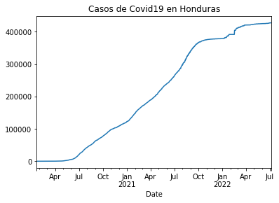
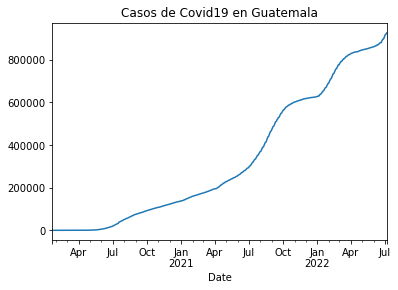

# Actividad dirigida 4

Esta es la actividad dirigia 4, en la que mostramos las diversas tablas o gráficos, en este caso con las cifras del Covid-19 tras un análisis de un sitio Web que mantiene actualizado los datos desde el inicio de la pandemia. 
Esta actividad la realizamos con el Pandas.

Me conecto a la API : https://api.covid19api.com/

## Instalación de Pandas
Para inciar el análisis de los datos instalamos el Pandas y posteriormente el numpy para trabajar con facilidad.


```python
!pip install pandas
```

    Defaulting to user installation because normal site-packages is not writeable
    Requirement already satisfied: pandas in c:\programdata\anaconda3\lib\site-packages (1.4.2)
    Requirement already satisfied: python-dateutil>=2.8.1 in c:\programdata\anaconda3\lib\site-packages (from pandas) (2.8.2)
    Requirement already satisfied: numpy>=1.18.5 in c:\programdata\anaconda3\lib\site-packages (from pandas) (1.21.5)
    Requirement already satisfied: pytz>=2020.1 in c:\programdata\anaconda3\lib\site-packages (from pandas) (2021.3)
    Requirement already satisfied: six>=1.5 in c:\programdata\anaconda3\lib\site-packages (from python-dateutil>=2.8.1->pandas) (1.16.0)
    


```python
pip install numpy
```

    Defaulting to user installation because normal site-packages is not writeable
    Requirement already satisfied: numpy in c:\programdata\anaconda3\lib\site-packages (1.21.5)
    Note: you may need to restart the kernel to use updated packages.
    

## Importar Pandas

Para trabajar con más facilidad, importamos Pandas a pd, para que la nomeclatura al momento de establece run código sea más práctica.


```python
import pandas as pd
```

## Selección de las ciudades con Covid19
Luego que le dimos importar Pandas, procedemos a seleccionar desde el sitio Web de API, las ciudades con Covid19.


```python
url = 'https://api.covid19api.com/countries'
```


```python
url 
```


    'https://api.covid19api.com/countries'


## Data Frame
Para poder reflejar los datos de las ciudades, creamos un data frame, en el que a través de Pandas llamaremos para su visualización. y el comando es: **df = pd.read_json(url)**


```python
df = pd.read_json(url)
```


```python
df
```


<div>
<style scoped>
    .dataframe tbody tr th:only-of-type {
        vertical-align: middle;
    }

    .dataframe tbody tr th {
        vertical-align: top;
    }

    .dataframe thead th {
        text-align: right;
    }
</style>
<table border="1" class="dataframe">
  <thead>
    <tr style="text-align: right;">
      <th></th>
      <th>Country</th>
      <th>Slug</th>
      <th>ISO2</th>
    </tr>
  </thead>
  <tbody>
    <tr>
      <th>0</th>
      <td>Gibraltar</td>
      <td>gibraltar</td>
      <td>GI</td>
    </tr>
    <tr>
      <th>1</th>
      <td>Oman</td>
      <td>oman</td>
      <td>OM</td>
    </tr>
    <tr>
      <th>2</th>
      <td>France</td>
      <td>france</td>
      <td>FR</td>
    </tr>
    <tr>
      <th>3</th>
      <td>Jersey</td>
      <td>jersey</td>
      <td>JE</td>
    </tr>
    <tr>
      <th>4</th>
      <td>Mali</td>
      <td>mali</td>
      <td>ML</td>
    </tr>
    <tr>
      <th>...</th>
      <td>...</td>
      <td>...</td>
      <td>...</td>
    </tr>
    <tr>
      <th>243</th>
      <td>Puerto Rico</td>
      <td>puerto-rico</td>
      <td>PR</td>
    </tr>
    <tr>
      <th>244</th>
      <td>Papua New Guinea</td>
      <td>papua-new-guinea</td>
      <td>PG</td>
    </tr>
    <tr>
      <th>245</th>
      <td>Saint Pierre and Miquelon</td>
      <td>saint-pierre-and-miquelon</td>
      <td>PM</td>
    </tr>
    <tr>
      <th>246</th>
      <td>Timor-Leste</td>
      <td>timor-leste</td>
      <td>TL</td>
    </tr>
    <tr>
      <th>247</th>
      <td>Montenegro</td>
      <td>montenegro</td>
      <td>ME</td>
    </tr>
  </tbody>
</table>
<p>248 rows × 3 columns</p>
</div>


## Visualización de datos

A continuación procedo a mostrar la vizualización de los datos, en la que mostraremos resutaldos de países como España y Panamá, para psoteriormente ver sus gráficos y ver el el desarrollo del virus.
De igual manera haremos comparación de estos dos países.
Adicional a ello hemos creado una visualización de los países Centroamericanos y su respectiva gráfica comparativa

## España

Los datos de Esapaña son mostrados a continuación:
Primero hacemos el data frame de este país, para conocer la posición y posteriormente mediante la url procedemos hacer el llamado de los datos desde el primer día de la pandemia hasta la fecha actual. esto lo haremos con: **df[df['Country'] == 'Spain']**


```python
df[df['Country'] == 'Spain']
```


<div>
<style scoped>
    .dataframe tbody tr th:only-of-type {
        vertical-align: middle;
    }

    .dataframe tbody tr th {
        vertical-align: top;
    }

    .dataframe thead th {
        text-align: right;
    }
</style>
<table border="1" class="dataframe">
  <thead>
    <tr style="text-align: right;">
      <th></th>
      <th>Country</th>
      <th>Slug</th>
      <th>ISO2</th>
    </tr>
  </thead>
  <tbody>
    <tr>
      <th>141</th>
      <td>Spain</td>
      <td>spain</td>
      <td>ES</td>
    </tr>
  </tbody>
</table>
</div>


```python
url_rt_es = 'https://api.covid19api.com/country/spain/status/confirmed/live'
df_rt_es = pd.read_json(url_rt_es) 
df_rt_es
```


<div>
<style scoped>
    .dataframe tbody tr th:only-of-type {
        vertical-align: middle;
    }

    .dataframe tbody tr th {
        vertical-align: top;
    }

    .dataframe thead th {
        text-align: right;
    }
</style>
<table border="1" class="dataframe">
  <thead>
    <tr style="text-align: right;">
      <th></th>
      <th>Country</th>
      <th>CountryCode</th>
      <th>Province</th>
      <th>City</th>
      <th>CityCode</th>
      <th>Lat</th>
      <th>Lon</th>
      <th>Cases</th>
      <th>Status</th>
      <th>Date</th>
    </tr>
  </thead>
  <tbody>
    <tr>
      <th>0</th>
      <td>Spain</td>
      <td>ES</td>
      <td></td>
      <td></td>
      <td></td>
      <td>40.46</td>
      <td>-3.75</td>
      <td>0</td>
      <td>confirmed</td>
      <td>2020-01-22 00:00:00+00:00</td>
    </tr>
    <tr>
      <th>1</th>
      <td>Spain</td>
      <td>ES</td>
      <td></td>
      <td></td>
      <td></td>
      <td>40.46</td>
      <td>-3.75</td>
      <td>0</td>
      <td>confirmed</td>
      <td>2020-01-23 00:00:00+00:00</td>
    </tr>
    <tr>
      <th>2</th>
      <td>Spain</td>
      <td>ES</td>
      <td></td>
      <td></td>
      <td></td>
      <td>40.46</td>
      <td>-3.75</td>
      <td>0</td>
      <td>confirmed</td>
      <td>2020-01-24 00:00:00+00:00</td>
    </tr>
    <tr>
      <th>3</th>
      <td>Spain</td>
      <td>ES</td>
      <td></td>
      <td></td>
      <td></td>
      <td>40.46</td>
      <td>-3.75</td>
      <td>0</td>
      <td>confirmed</td>
      <td>2020-01-25 00:00:00+00:00</td>
    </tr>
    <tr>
      <th>4</th>
      <td>Spain</td>
      <td>ES</td>
      <td></td>
      <td></td>
      <td></td>
      <td>40.46</td>
      <td>-3.75</td>
      <td>0</td>
      <td>confirmed</td>
      <td>2020-01-26 00:00:00+00:00</td>
    </tr>
    <tr>
      <th>...</th>
      <td>...</td>
      <td>...</td>
      <td>...</td>
      <td>...</td>
      <td>...</td>
      <td>...</td>
      <td>...</td>
      <td>...</td>
      <td>...</td>
      <td>...</td>
    </tr>
    <tr>
      <th>892</th>
      <td>Spain</td>
      <td>ES</td>
      <td></td>
      <td></td>
      <td></td>
      <td>40.46</td>
      <td>-3.75</td>
      <td>12818184</td>
      <td>confirmed</td>
      <td>2022-07-02 00:00:00+00:00</td>
    </tr>
    <tr>
      <th>893</th>
      <td>Spain</td>
      <td>ES</td>
      <td></td>
      <td></td>
      <td></td>
      <td>40.46</td>
      <td>-3.75</td>
      <td>12818184</td>
      <td>confirmed</td>
      <td>2022-07-03 00:00:00+00:00</td>
    </tr>
    <tr>
      <th>894</th>
      <td>Spain</td>
      <td>ES</td>
      <td></td>
      <td></td>
      <td></td>
      <td>40.46</td>
      <td>-3.75</td>
      <td>12818184</td>
      <td>confirmed</td>
      <td>2022-07-04 00:00:00+00:00</td>
    </tr>
    <tr>
      <th>895</th>
      <td>Spain</td>
      <td>ES</td>
      <td></td>
      <td></td>
      <td></td>
      <td>40.46</td>
      <td>-3.75</td>
      <td>12890002</td>
      <td>confirmed</td>
      <td>2022-07-05 00:00:00+00:00</td>
    </tr>
    <tr>
      <th>896</th>
      <td>Spain</td>
      <td>ES</td>
      <td></td>
      <td></td>
      <td></td>
      <td>40.46</td>
      <td>-3.75</td>
      <td>12890002</td>
      <td>confirmed</td>
      <td>2022-07-06 00:00:00+00:00</td>
    </tr>
  </tbody>
</table>
<p>897 rows × 10 columns</p>
</div>


Con este data frame mostramos la cabecera de los resultados en España


```python
df_rt_es.head()
```


<div>
<style scoped>
    .dataframe tbody tr th:only-of-type {
        vertical-align: middle;
    }

    .dataframe tbody tr th {
        vertical-align: top;
    }

    .dataframe thead th {
        text-align: right;
    }
</style>
<table border="1" class="dataframe">
  <thead>
    <tr style="text-align: right;">
      <th></th>
      <th>Country</th>
      <th>CountryCode</th>
      <th>Province</th>
      <th>City</th>
      <th>CityCode</th>
      <th>Lat</th>
      <th>Lon</th>
      <th>Cases</th>
      <th>Status</th>
      <th>Date</th>
    </tr>
  </thead>
  <tbody>
    <tr>
      <th>0</th>
      <td>Spain</td>
      <td>ES</td>
      <td></td>
      <td></td>
      <td></td>
      <td>40.46</td>
      <td>-3.75</td>
      <td>0</td>
      <td>confirmed</td>
      <td>2020-01-22 00:00:00+00:00</td>
    </tr>
    <tr>
      <th>1</th>
      <td>Spain</td>
      <td>ES</td>
      <td></td>
      <td></td>
      <td></td>
      <td>40.46</td>
      <td>-3.75</td>
      <td>0</td>
      <td>confirmed</td>
      <td>2020-01-23 00:00:00+00:00</td>
    </tr>
    <tr>
      <th>2</th>
      <td>Spain</td>
      <td>ES</td>
      <td></td>
      <td></td>
      <td></td>
      <td>40.46</td>
      <td>-3.75</td>
      <td>0</td>
      <td>confirmed</td>
      <td>2020-01-24 00:00:00+00:00</td>
    </tr>
    <tr>
      <th>3</th>
      <td>Spain</td>
      <td>ES</td>
      <td></td>
      <td></td>
      <td></td>
      <td>40.46</td>
      <td>-3.75</td>
      <td>0</td>
      <td>confirmed</td>
      <td>2020-01-25 00:00:00+00:00</td>
    </tr>
    <tr>
      <th>4</th>
      <td>Spain</td>
      <td>ES</td>
      <td></td>
      <td></td>
      <td></td>
      <td>40.46</td>
      <td>-3.75</td>
      <td>0</td>
      <td>confirmed</td>
      <td>2020-01-26 00:00:00+00:00</td>
    </tr>
  </tbody>
</table>
</div>


Con este otro data frame se muestra la parte final de la tabla.


```python
df_rt_es.tail()
```


<div>
<style scoped>
    .dataframe tbody tr th:only-of-type {
        vertical-align: middle;
    }

    .dataframe tbody tr th {
        vertical-align: top;
    }

    .dataframe thead th {
        text-align: right;
    }
</style>
<table border="1" class="dataframe">
  <thead>
    <tr style="text-align: right;">
      <th></th>
      <th>Country</th>
      <th>CountryCode</th>
      <th>Province</th>
      <th>City</th>
      <th>CityCode</th>
      <th>Lat</th>
      <th>Lon</th>
      <th>Cases</th>
      <th>Status</th>
      <th>Date</th>
    </tr>
  </thead>
  <tbody>
    <tr>
      <th>892</th>
      <td>Spain</td>
      <td>ES</td>
      <td></td>
      <td></td>
      <td></td>
      <td>40.46</td>
      <td>-3.75</td>
      <td>12818184</td>
      <td>confirmed</td>
      <td>2022-07-02 00:00:00+00:00</td>
    </tr>
    <tr>
      <th>893</th>
      <td>Spain</td>
      <td>ES</td>
      <td></td>
      <td></td>
      <td></td>
      <td>40.46</td>
      <td>-3.75</td>
      <td>12818184</td>
      <td>confirmed</td>
      <td>2022-07-03 00:00:00+00:00</td>
    </tr>
    <tr>
      <th>894</th>
      <td>Spain</td>
      <td>ES</td>
      <td></td>
      <td></td>
      <td></td>
      <td>40.46</td>
      <td>-3.75</td>
      <td>12818184</td>
      <td>confirmed</td>
      <td>2022-07-04 00:00:00+00:00</td>
    </tr>
    <tr>
      <th>895</th>
      <td>Spain</td>
      <td>ES</td>
      <td></td>
      <td></td>
      <td></td>
      <td>40.46</td>
      <td>-3.75</td>
      <td>12890002</td>
      <td>confirmed</td>
      <td>2022-07-05 00:00:00+00:00</td>
    </tr>
    <tr>
      <th>896</th>
      <td>Spain</td>
      <td>ES</td>
      <td></td>
      <td></td>
      <td></td>
      <td>40.46</td>
      <td>-3.75</td>
      <td>12890002</td>
      <td>confirmed</td>
      <td>2022-07-06 00:00:00+00:00</td>
    </tr>
  </tbody>
</table>
</div>


## Gráfica 

Para mostrar los datos y observar el comportamiento, hemos creado una gráfica y dstacaremos a través de otro data frame la fecha y los casos.
En este punto mediante el comando **casos_es.plot()** plotearemos los datos para que se visualicen los resultados. A esto le colcoamos el título de la gráfica para su identificación.


```python
casos_es = df_rt_es.set_index('Date')['Cases']
casos_es.plot(title="Casos de Covid-19 en España")
```


    <AxesSubplot:title={'center':'Casos de Covid-19 en España'}, xlabel='Date'>


    

    


## Panamá

En el caso de Panamá, procedimos a realizar el mismo paso que en España.
1. Creamos un data frame de la ciudad para concoer su posición
2. Hicimos la sellección de los datos a través del url de API.
3. Creamos otro data frame para hacer el llaamdao a través de Pandas de la información del url 
4. Procedimos a visualizar el gráfico para conocer el comprotamiento del virus desde el día 1 a la actualidad. igual manera lo ploteamos para que se posteara.


### Paso 1


```python
df[df['Country'] == 'Panama'] 
```


<div>
<style scoped>
    .dataframe tbody tr th:only-of-type {
        vertical-align: middle;
    }

    .dataframe tbody tr th {
        vertical-align: top;
    }

    .dataframe thead th {
        text-align: right;
    }
</style>
<table border="1" class="dataframe">
  <thead>
    <tr style="text-align: right;">
      <th></th>
      <th>Country</th>
      <th>Slug</th>
      <th>ISO2</th>
    </tr>
  </thead>
  <tbody>
    <tr>
      <th>190</th>
      <td>Panama</td>
      <td>panama</td>
      <td>PA</td>
    </tr>
  </tbody>
</table>
</div>


### Paso 2


```python
url_casos_pa = 'https://api.covid19api.com/country/panama/status/confirmed/live'
```

### Paso 3


```python
df_rt_pa = pd.read_json(url_casos_pa)
```


```python
df_rt_pa
```


<div>
<style scoped>
    .dataframe tbody tr th:only-of-type {
        vertical-align: middle;
    }

    .dataframe tbody tr th {
        vertical-align: top;
    }

    .dataframe thead th {
        text-align: right;
    }
</style>
<table border="1" class="dataframe">
  <thead>
    <tr style="text-align: right;">
      <th></th>
      <th>Country</th>
      <th>CountryCode</th>
      <th>Province</th>
      <th>City</th>
      <th>CityCode</th>
      <th>Lat</th>
      <th>Lon</th>
      <th>Cases</th>
      <th>Status</th>
      <th>Date</th>
    </tr>
  </thead>
  <tbody>
    <tr>
      <th>0</th>
      <td>Panama</td>
      <td>PA</td>
      <td></td>
      <td></td>
      <td></td>
      <td>8.54</td>
      <td>-80.78</td>
      <td>0</td>
      <td>confirmed</td>
      <td>2020-01-22 00:00:00+00:00</td>
    </tr>
    <tr>
      <th>1</th>
      <td>Panama</td>
      <td>PA</td>
      <td></td>
      <td></td>
      <td></td>
      <td>8.54</td>
      <td>-80.78</td>
      <td>0</td>
      <td>confirmed</td>
      <td>2020-01-23 00:00:00+00:00</td>
    </tr>
    <tr>
      <th>2</th>
      <td>Panama</td>
      <td>PA</td>
      <td></td>
      <td></td>
      <td></td>
      <td>8.54</td>
      <td>-80.78</td>
      <td>0</td>
      <td>confirmed</td>
      <td>2020-01-24 00:00:00+00:00</td>
    </tr>
    <tr>
      <th>3</th>
      <td>Panama</td>
      <td>PA</td>
      <td></td>
      <td></td>
      <td></td>
      <td>8.54</td>
      <td>-80.78</td>
      <td>0</td>
      <td>confirmed</td>
      <td>2020-01-25 00:00:00+00:00</td>
    </tr>
    <tr>
      <th>4</th>
      <td>Panama</td>
      <td>PA</td>
      <td></td>
      <td></td>
      <td></td>
      <td>8.54</td>
      <td>-80.78</td>
      <td>0</td>
      <td>confirmed</td>
      <td>2020-01-26 00:00:00+00:00</td>
    </tr>
    <tr>
      <th>...</th>
      <td>...</td>
      <td>...</td>
      <td>...</td>
      <td>...</td>
      <td>...</td>
      <td>...</td>
      <td>...</td>
      <td>...</td>
      <td>...</td>
      <td>...</td>
    </tr>
    <tr>
      <th>893</th>
      <td>Panama</td>
      <td>PA</td>
      <td></td>
      <td></td>
      <td></td>
      <td>8.54</td>
      <td>-80.78</td>
      <td>925254</td>
      <td>confirmed</td>
      <td>2022-07-03 00:00:00+00:00</td>
    </tr>
    <tr>
      <th>894</th>
      <td>Panama</td>
      <td>PA</td>
      <td></td>
      <td></td>
      <td></td>
      <td>8.54</td>
      <td>-80.78</td>
      <td>925254</td>
      <td>confirmed</td>
      <td>2022-07-04 00:00:00+00:00</td>
    </tr>
    <tr>
      <th>895</th>
      <td>Panama</td>
      <td>PA</td>
      <td></td>
      <td></td>
      <td></td>
      <td>8.54</td>
      <td>-80.78</td>
      <td>925254</td>
      <td>confirmed</td>
      <td>2022-07-05 00:00:00+00:00</td>
    </tr>
    <tr>
      <th>896</th>
      <td>Panama</td>
      <td>PA</td>
      <td></td>
      <td></td>
      <td></td>
      <td>8.54</td>
      <td>-80.78</td>
      <td>925254</td>
      <td>confirmed</td>
      <td>2022-07-06 00:00:00+00:00</td>
    </tr>
    <tr>
      <th>897</th>
      <td>Panama</td>
      <td>PA</td>
      <td></td>
      <td></td>
      <td></td>
      <td>8.54</td>
      <td>-80.78</td>
      <td>925254</td>
      <td>confirmed</td>
      <td>2022-07-07 00:00:00+00:00</td>
    </tr>
  </tbody>
</table>
<p>898 rows × 10 columns</p>
</div>


### Paso 4


```python
casos_pa = df_rt_pa.set_index('Date')['Cases']
casos_pa.plot(title="Casos de Covid19 en Panamá")
```


    <AxesSubplot:title={'center':'Casos de Covid19 en Panamá'}, xlabel='Date'>


    

    


## Ploteamos dos países

En esta ocasión hicimos la comparación de los casos de España y panamá, el cual plteamos y mostramos la gráfica comparativa sobre el comprtamiento del virus desde el incio de la pandemia.
#### Pasos:
1. Mediante pa_vs_es = pd.concat([casos_es,casos_pa],axis=1) hacemos el llamado de la selección de la selección de ambas tablas.
2. Le colocamos el nombre para identificarla.


```python
pa_vs_es = pd.concat([casos_es,casos_pa],axis=1)
pa_vs_es
```


<div>
<style scoped>
    .dataframe tbody tr th:only-of-type {
        vertical-align: middle;
    }

    .dataframe tbody tr th {
        vertical-align: top;
    }

    .dataframe thead th {
        text-align: right;
    }
</style>
<table border="1" class="dataframe">
  <thead>
    <tr style="text-align: right;">
      <th></th>
      <th>Cases</th>
      <th>Cases</th>
    </tr>
    <tr>
      <th>Date</th>
      <th></th>
      <th></th>
    </tr>
  </thead>
  <tbody>
    <tr>
      <th>2020-01-22 00:00:00+00:00</th>
      <td>0.0</td>
      <td>0</td>
    </tr>
    <tr>
      <th>2020-01-23 00:00:00+00:00</th>
      <td>0.0</td>
      <td>0</td>
    </tr>
    <tr>
      <th>2020-01-24 00:00:00+00:00</th>
      <td>0.0</td>
      <td>0</td>
    </tr>
    <tr>
      <th>2020-01-25 00:00:00+00:00</th>
      <td>0.0</td>
      <td>0</td>
    </tr>
    <tr>
      <th>2020-01-26 00:00:00+00:00</th>
      <td>0.0</td>
      <td>0</td>
    </tr>
    <tr>
      <th>...</th>
      <td>...</td>
      <td>...</td>
    </tr>
    <tr>
      <th>2022-07-03 00:00:00+00:00</th>
      <td>12818184.0</td>
      <td>925254</td>
    </tr>
    <tr>
      <th>2022-07-04 00:00:00+00:00</th>
      <td>12818184.0</td>
      <td>925254</td>
    </tr>
    <tr>
      <th>2022-07-05 00:00:00+00:00</th>
      <td>12890002.0</td>
      <td>925254</td>
    </tr>
    <tr>
      <th>2022-07-06 00:00:00+00:00</th>
      <td>12890002.0</td>
      <td>925254</td>
    </tr>
    <tr>
      <th>2022-07-07 00:00:00+00:00</th>
      <td>NaN</td>
      <td>925254</td>
    </tr>
  </tbody>
</table>
<p>898 rows × 2 columns</p>
</div>


En este paso procedemos a identicar cada columna para saber los resultados de cada país, ya que en la tabla anterior solo nos mostraba la variable casos, sin especificar a qué país correspondía cada columna.


```python
pa_vs_es.columns = ['España', 'Panamá']
pa_vs_es
```


<div>
<style scoped>
    .dataframe tbody tr th:only-of-type {
        vertical-align: middle;
    }

    .dataframe tbody tr th {
        vertical-align: top;
    }

    .dataframe thead th {
        text-align: right;
    }
</style>
<table border="1" class="dataframe">
  <thead>
    <tr style="text-align: right;">
      <th></th>
      <th>España</th>
      <th>Panamá</th>
    </tr>
    <tr>
      <th>Date</th>
      <th></th>
      <th></th>
    </tr>
  </thead>
  <tbody>
    <tr>
      <th>2020-01-22 00:00:00+00:00</th>
      <td>0.0</td>
      <td>0</td>
    </tr>
    <tr>
      <th>2020-01-23 00:00:00+00:00</th>
      <td>0.0</td>
      <td>0</td>
    </tr>
    <tr>
      <th>2020-01-24 00:00:00+00:00</th>
      <td>0.0</td>
      <td>0</td>
    </tr>
    <tr>
      <th>2020-01-25 00:00:00+00:00</th>
      <td>0.0</td>
      <td>0</td>
    </tr>
    <tr>
      <th>2020-01-26 00:00:00+00:00</th>
      <td>0.0</td>
      <td>0</td>
    </tr>
    <tr>
      <th>...</th>
      <td>...</td>
      <td>...</td>
    </tr>
    <tr>
      <th>2022-07-03 00:00:00+00:00</th>
      <td>12818184.0</td>
      <td>925254</td>
    </tr>
    <tr>
      <th>2022-07-04 00:00:00+00:00</th>
      <td>12818184.0</td>
      <td>925254</td>
    </tr>
    <tr>
      <th>2022-07-05 00:00:00+00:00</th>
      <td>12890002.0</td>
      <td>925254</td>
    </tr>
    <tr>
      <th>2022-07-06 00:00:00+00:00</th>
      <td>12890002.0</td>
      <td>925254</td>
    </tr>
    <tr>
      <th>2022-07-07 00:00:00+00:00</th>
      <td>NaN</td>
      <td>925254</td>
    </tr>
  </tbody>
</table>
<p>898 rows × 2 columns</p>
</div>


### Gráfica de comparación
Mediante el ploteó, procedimos a realizar la gráfica comparativa en la que se muestra el comportamiento del virus en ambos países y lo hicimos con el comando: **pa_vs_es.plot()**


```python
pa_vs_es.plot(title="Comparativa Covid19 España-Paanamá")
```


    <AxesSubplot:title={'center':'Comparativa Covid19 España-Paanamá'}, xlabel='Date'>


    

    


### Comparación de países Centroamericanos 

En esta ocasión, realizamos una comparación del comprotamiento del virus Covid19, en los paises Centroamericanos y lo hicimos tal cual realizamos con España y Panamá.
1. Primero dividí los casos de cada país, en este caso de Costa Rica, El Salvado, Honduras, Nicaragua y Gautemala, para posteriormente realizar la comparación.
2. Los casos de cada país lo hice con el url de API.
3. Hice el llamado a través de Pandas.
4. Hice el plot del gráfico.

### Costa Rica


```python
url_casos_cr = 'https://api.covid19api.com/country/costa-rica/status/confirmed/live'
df_rt_cr = pd.read_json(url_casos_cr)
casos_cr = df_rt_cr.set_index('Date')['Cases']
```


```python
casos_cr.plot(title="Casos de Covid19 en Costa Rica")
```


    <AxesSubplot:title={'center':'Casos de Covid19 en Costa Rica'}, xlabel='Date'>


    

    


### Honduras


```python
url_casos_hnd = 'https://api.covid19api.com/country/honduras/status/confirmed/live'
df_rt_hnd = pd.read_json(url_casos_hnd)
casos_hnd = df_rt_hnd.set_index('Date')['Cases']
casos_hnd.plot(title="Casos de Covid19 en Honduras")
```


    <AxesSubplot:title={'center':'Casos de Covid19 en Honduras'}, xlabel='Date'>


    

    


### Guatemala


```python
url_casos_guat = 'https://api.covid19api.com/country/guatemala/status/confirmed/live'
df_rt_guat = pd.read_json(url_casos_guat)
casos_guat = df_rt_guat.set_index('Date')['Cases']
casos_guat.plot(title="Casos de Covid19 en Guatemala")
```


    <AxesSubplot:title={'center':'Casos de Covid19 en Guatemala'}, xlabel='Date'>


    

    


### El Salvador


```python
url_casos_elsalv = 'https://api.covid19api.com/country/el-salvador/status/confirmed/live'
df_rt_elsalv = pd.read_json(url_casos_elsalv)
casos_elsalv = df_rt_elsalv.set_index('Date')['Cases']
casos_elsalv.plot(title="Casos de Covid19 en El Salvador")
```


    <AxesSubplot:title={'center':'Casos de Covid19 en El Salvador'}, xlabel='Date'>


    

    


### Nicaragua


```python
url_casos_ni = 'https://api.covid19api.com/country/nicaragua/status/confirmed/live'
df_rt_ni = pd.read_json(url_casos_ni)
casos_ni = df_rt_ni.set_index('Date')['Cases']
casos_ni.plot(title="Casos de Covid19 en Nicaraguas")
```


    <AxesSubplot:title={'center':'Casos de Covid19 en Nicaraguas'}, xlabel='Date'>


    

    


### Comparación de países Centroamericanos


```python
pa_vs_cr_vs_hnd_vs_guat_vs_elsalv_vs_ni = pd.concat([casos_pa,casos_cr,casos_hnd,casos_elsalv,casos_guat,casos_ni],axis=1)
pa_vs_cr_vs_hnd_vs_guat_vs_elsalv_vs_ni

```


<div>
<style scoped>
    .dataframe tbody tr th:only-of-type {
        vertical-align: middle;
    }

    .dataframe tbody tr th {
        vertical-align: top;
    }

    .dataframe thead th {
        text-align: right;
    }
</style>
<table border="1" class="dataframe">
  <thead>
    <tr style="text-align: right;">
      <th></th>
      <th>Cases</th>
      <th>Cases</th>
      <th>Cases</th>
      <th>Cases</th>
      <th>Cases</th>
      <th>Cases</th>
    </tr>
    <tr>
      <th>Date</th>
      <th></th>
      <th></th>
      <th></th>
      <th></th>
      <th></th>
      <th></th>
    </tr>
  </thead>
  <tbody>
    <tr>
      <th>2020-01-22 00:00:00+00:00</th>
      <td>0</td>
      <td>0</td>
      <td>0</td>
      <td>0</td>
      <td>0</td>
      <td>0</td>
    </tr>
    <tr>
      <th>2020-01-23 00:00:00+00:00</th>
      <td>0</td>
      <td>0</td>
      <td>0</td>
      <td>0</td>
      <td>0</td>
      <td>0</td>
    </tr>
    <tr>
      <th>2020-01-24 00:00:00+00:00</th>
      <td>0</td>
      <td>0</td>
      <td>0</td>
      <td>0</td>
      <td>0</td>
      <td>0</td>
    </tr>
    <tr>
      <th>2020-01-25 00:00:00+00:00</th>
      <td>0</td>
      <td>0</td>
      <td>0</td>
      <td>0</td>
      <td>0</td>
      <td>0</td>
    </tr>
    <tr>
      <th>2020-01-26 00:00:00+00:00</th>
      <td>0</td>
      <td>0</td>
      <td>0</td>
      <td>0</td>
      <td>0</td>
      <td>0</td>
    </tr>
    <tr>
      <th>...</th>
      <td>...</td>
      <td>...</td>
      <td>...</td>
      <td>...</td>
      <td>...</td>
      <td>...</td>
    </tr>
    <tr>
      <th>2022-07-03 00:00:00+00:00</th>
      <td>925254</td>
      <td>904934</td>
      <td>427718</td>
      <td>169646</td>
      <td>920294</td>
      <td>14690</td>
    </tr>
    <tr>
      <th>2022-07-04 00:00:00+00:00</th>
      <td>925254</td>
      <td>904934</td>
      <td>427718</td>
      <td>169646</td>
      <td>921146</td>
      <td>14690</td>
    </tr>
    <tr>
      <th>2022-07-05 00:00:00+00:00</th>
      <td>925254</td>
      <td>904934</td>
      <td>427718</td>
      <td>169646</td>
      <td>922340</td>
      <td>14690</td>
    </tr>
    <tr>
      <th>2022-07-06 00:00:00+00:00</th>
      <td>925254</td>
      <td>904934</td>
      <td>427718</td>
      <td>169646</td>
      <td>927473</td>
      <td>14721</td>
    </tr>
    <tr>
      <th>2022-07-07 00:00:00+00:00</th>
      <td>925254</td>
      <td>904934</td>
      <td>427718</td>
      <td>169646</td>
      <td>927473</td>
      <td>14721</td>
    </tr>
  </tbody>
</table>
<p>898 rows × 6 columns</p>
</div>


```python
pa_vs_cr_vs_hnd_vs_guat_vs_elsalv_vs_ni.columns = ['Panamá','Costa Rica','Hondruas','Guaemala','El Salvador','Nicaragua']
pa_vs_cr_vs_hnd_vs_guat_vs_elsalv_vs_ni
```


<div>
<style scoped>
    .dataframe tbody tr th:only-of-type {
        vertical-align: middle;
    }

    .dataframe tbody tr th {
        vertical-align: top;
    }

    .dataframe thead th {
        text-align: right;
    }
</style>
<table border="1" class="dataframe">
  <thead>
    <tr style="text-align: right;">
      <th></th>
      <th>Panamá</th>
      <th>Costa Rica</th>
      <th>Hondruas</th>
      <th>Guaemala</th>
      <th>El Salvador</th>
      <th>Nicaragua</th>
    </tr>
    <tr>
      <th>Date</th>
      <th></th>
      <th></th>
      <th></th>
      <th></th>
      <th></th>
      <th></th>
    </tr>
  </thead>
  <tbody>
    <tr>
      <th>2020-01-22 00:00:00+00:00</th>
      <td>0</td>
      <td>0</td>
      <td>0</td>
      <td>0</td>
      <td>0</td>
      <td>0</td>
    </tr>
    <tr>
      <th>2020-01-23 00:00:00+00:00</th>
      <td>0</td>
      <td>0</td>
      <td>0</td>
      <td>0</td>
      <td>0</td>
      <td>0</td>
    </tr>
    <tr>
      <th>2020-01-24 00:00:00+00:00</th>
      <td>0</td>
      <td>0</td>
      <td>0</td>
      <td>0</td>
      <td>0</td>
      <td>0</td>
    </tr>
    <tr>
      <th>2020-01-25 00:00:00+00:00</th>
      <td>0</td>
      <td>0</td>
      <td>0</td>
      <td>0</td>
      <td>0</td>
      <td>0</td>
    </tr>
    <tr>
      <th>2020-01-26 00:00:00+00:00</th>
      <td>0</td>
      <td>0</td>
      <td>0</td>
      <td>0</td>
      <td>0</td>
      <td>0</td>
    </tr>
    <tr>
      <th>...</th>
      <td>...</td>
      <td>...</td>
      <td>...</td>
      <td>...</td>
      <td>...</td>
      <td>...</td>
    </tr>
    <tr>
      <th>2022-07-03 00:00:00+00:00</th>
      <td>925254</td>
      <td>904934</td>
      <td>427718</td>
      <td>169646</td>
      <td>920294</td>
      <td>14690</td>
    </tr>
    <tr>
      <th>2022-07-04 00:00:00+00:00</th>
      <td>925254</td>
      <td>904934</td>
      <td>427718</td>
      <td>169646</td>
      <td>921146</td>
      <td>14690</td>
    </tr>
    <tr>
      <th>2022-07-05 00:00:00+00:00</th>
      <td>925254</td>
      <td>904934</td>
      <td>427718</td>
      <td>169646</td>
      <td>922340</td>
      <td>14690</td>
    </tr>
    <tr>
      <th>2022-07-06 00:00:00+00:00</th>
      <td>925254</td>
      <td>904934</td>
      <td>427718</td>
      <td>169646</td>
      <td>927473</td>
      <td>14721</td>
    </tr>
    <tr>
      <th>2022-07-07 00:00:00+00:00</th>
      <td>925254</td>
      <td>904934</td>
      <td>427718</td>
      <td>169646</td>
      <td>927473</td>
      <td>14721</td>
    </tr>
  </tbody>
</table>
<p>898 rows × 6 columns</p>
</div>


```python
pa_vs_cr_vs_hnd_vs_guat_vs_elsalv_vs_ni.plot(title="Comparativa Covid19 de países Centroamericanos")
```


    <AxesSubplot:title={'center':'Comparativa Covid19 de países Centroamericanos'}, xlabel='Date'>


    

    

